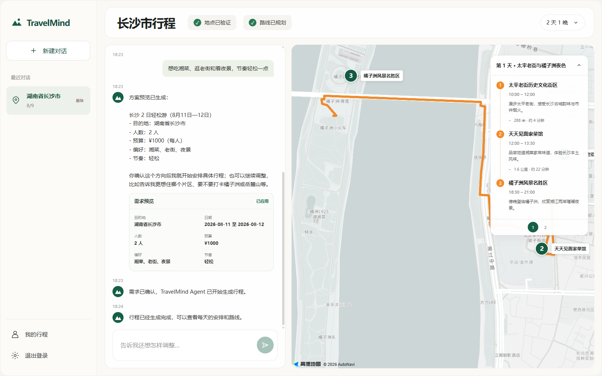
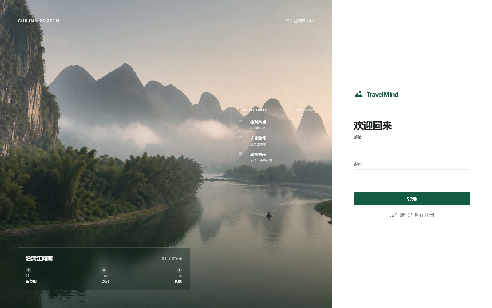
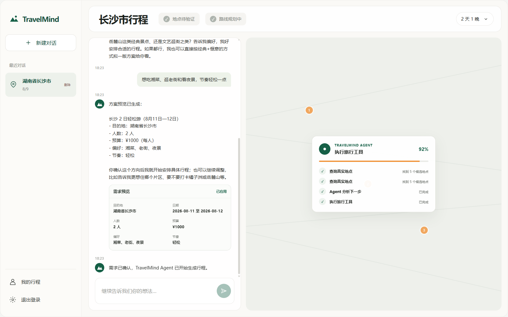
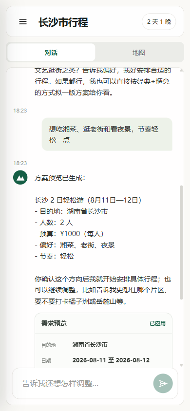
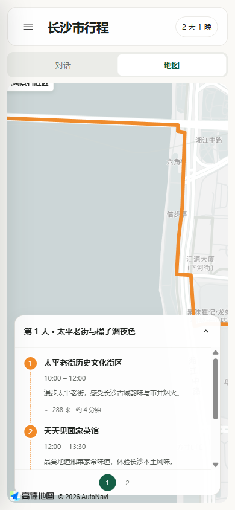
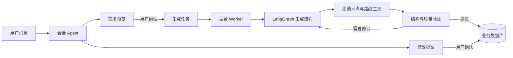

# TravelMind

一个把旅行对话变成可验证地图路线的个人全栈项目。

TravelMind 允许用户先选定目的地，再通过自然语言逐步补充日期、人数、预算和偏好。需求确认后，Agent 会查询真实地点、规划路线，并把结果保存为可以继续对话修改的行程。

**[打开在线演示](https://travelmind-production-18d8.up.railway.app)**

测试账号：`demo@travelmind.app`　密码：`TravelMind2026!`

> 演示账号的数据由访客共享。为了控制开源展示成本，服务会自动休眠，并限制每个账号及全站的每日对话、生成次数；首次访问可能需要等待短暂冷启动。



> 当前版本面向中国大陆旅行场景，使用 DeepSeek 处理对话与规划，使用高德地图验证地点和路线。

## 为什么做这个项目

普通大模型可以很快写出一段旅行计划，但其中的地点可能不存在，路线也未必合理；生成结束后，用户通常还要重新描述全部需求才能修改。

我想尝试另一种做法：让模型负责理解意图和选择工具，让后端负责权限、状态、数据约束和最终写入。这样生成结果不只是一段文本，而是一份经过地点验证、能够在地图上展示、还能继续调整的行程。

这个项目也是我学习如何使用 AI 完成真实软件工程的过程。重点不只是接入模型 API，而是处理模型输出不稳定、长任务中断、工具调用、数据一致性和前后端状态同步这些实际问题。

## 一次规划怎样完成

```text
选择省市 → 多轮对话 → 需求预览 → 用户确认
        → Agent 调用地点与路线工具 → Worker 保存行程
        → 地图展示 → 继续通过聊天修改
```

一个典型流程是：

1. 用户先选择省份和城市，避免地点识别在对话中反复摇摆。
2. Agent 通过多轮对话收集日期、人数、预算和偏好；没想好的字段可以使用合理默认值。
3. 信息收敛后生成需求预览，用户确认前不会创建正式行程。
4. 确认后，API 只负责创建后台任务，独立 Worker 执行模型和地图工具。
5. 地点通过高德 POI 验证后，系统保存坐标、路线和每天的活动。
6. 用户可以继续在原对话中提出修改，先查看修改提案，再决定是否应用。

<details>
<summary>查看更多界面</summary>

### 登录页



### Agent 生成过程



### 移动端

<p align="center">
  
  
</p>

</details>

## Agent 与系统边界

TravelMind 使用 LangChain 描述工具，使用 LangGraph 编排对话与行程生成状态。Agent 可以判断下一步该追问、生成预览还是调用工具，但不能直接修改数据库。



这里有几条刻意保留的边界：

| 决策 | 原因 |
| --- | --- |
| 先选择省市，再开放对话 | 地理范围是确定信息，不需要让模型反复猜测 |
| 模型提出方案，程序验证并写入 | 防止不完整或错误结构直接污染数据库 |
| 创建行程与生成行程分开 | 长时间模型调用不阻塞普通 API 请求 |
| 生成任务由独立 Worker 执行 | API 重启后仍可恢复未完成任务 |
| 修改先形成提案 | 用户确认前不覆盖现有行程 |

LangGraph 检查点保存在本地 SQLite 文件中；每个 `GenerationRun` 都有独立 thread ID。SQLAlchemy 数据库仍然是用户、对话、提案和最终行程的业务事实来源。

## 当前实现

- JWT 注册登录和用户数据隔离
- 会话上下文、需求草稿与预览确认
- LangGraph 对话 Agent 和行程生成流程
- DeepSeek 结构化输出
- 高德 POI 搜索、地点验证和步行路线规划
- 可恢复的后台生成任务与可视化进度
- 通过聊天生成修改提案并应用新行程
- 桌面端与移动端地图/对话布局
- Alembic 数据库迁移和 144 项后端测试

## 技术栈

| 部分 | 使用的技术 |
| --- | --- |
| 前端 | Vue 3、Vue Router、Vite、高德地图 JS API |
| API | FastAPI、Pydantic、JWT |
| Agent | LangChain、LangGraph、DeepSeek |
| 数据 | SQLAlchemy、Alembic、SQLite |
| 后台任务 | 独立 Python Worker、数据库任务队列、LangGraph checkpoint |
| 测试 | unittest、FastAPI TestClient、Playwright |

## 项目结构

```text
travelmind/
├── app/
│   ├── agent/             # 行程生成图、工具和质量检查
│   ├── conversations/     # 对话 Agent、状态与需求草稿
│   ├── generation/        # 后台任务与 Worker
│   ├── integrations/      # DeepSeek 与高德地图
│   ├── itinerary/         # 行程读取和编辑
│   ├── auth/              # 登录、JWT 与权限
│   └── db/                # SQLAlchemy 模型和会话
├── frontend/              # Vue 前端
├── alembic/               # 数据库迁移
├── tests/                 # 回归测试
├── evals/                 # Agent 评测用例与结果
├── dev.py                 # 同时启动本地 API、Worker 和 Vite
├── production.py          # 迁移、演示账号与生产进程启动器
└── Dockerfile             # Vue + FastAPI + Worker 单容器镜像
```

## 本地运行

以下命令以 Windows PowerShell 为例。

### 1. 安装后端依赖

```powershell
python -m venv .venv
.\.venv\Scripts\python.exe -m pip install -r requirements.txt
```

### 2. 配置环境变量

```powershell
Copy-Item .env.example .env
Copy-Item frontend/.env.example frontend/.env
python -c "import secrets; print(secrets.token_urlsafe(48))"
```

把最后一条命令生成的随机值填入 `.env` 的 `JWT_SECRET_KEY`，再配置以下服务：

| 变量 | 用途 |
| --- | --- |
| `DEEPSEEK_API_KEY` | 对话和行程生成 |
| `AMAP_API_KEY` | 后端 POI 与路线 Web 服务 |
| `JWT_SECRET_KEY` | 本地身份令牌签名，至少 32 个随机字符 |
| `VITE_AMAP_JS_KEY` | 浏览器高德 JS API，填写在 `frontend/.env` |
| `VITE_AMAP_SECURITY_CODE` | 高德 JS API 安全密钥，填写在 `frontend/.env` |

后端 Web 服务 Key 和前端 JS API Key 不是同一种 Key，请分别在高德控制台创建。

### 3. 建立数据库

```powershell
.\.venv\Scripts\python.exe bootstrap_db.py
```

### 4. 安装前端依赖

```powershell
Set-Location frontend
pnpm install
Set-Location ..
```

### 5. 启动

```powershell
.\.venv\Scripts\python.exe dev.py
```

打开 `http://127.0.0.1:5173`。这个命令会同时启动 FastAPI、生成 Worker 和 Vue 前端，按 `Ctrl+C` 可以一起停止。

如需分别启动：

```powershell
.\.venv\Scripts\python.exe -m uvicorn app.main:app --reload
.\.venv\Scripts\python.exe -m app.generation.worker
```

## Railway 单服务部署

仓库根目录的 `Dockerfile` 会先构建 Vue，再由 FastAPI 提供静态页面；`production.py` 在容器启动时依次执行 Alembic、准备演示账号，并同时启动 API 与生成 Worker。因此公开演示只需要一个 Railway 服务和一个 `/data` 持久化卷。

生产环境至少需要配置这些变量：

| 变量 | 建议值或用途 |
| --- | --- |
| `DATABASE_URL` | `sqlite:////data/travelmind.db` |
| `LANGGRAPH_CHECKPOINT_PATH` | `/data/langgraph-checkpoints.db` |
| `JWT_SECRET_KEY` | 至少 32 位随机值 |
| `DEEPSEEK_API_KEY` | 仅保存在 Railway Variables |
| `AMAP_API_KEY` | 后端 Web 服务 Key |
| `VITE_AMAP_JS_KEY` | Docker 构建前端时使用的 JS API Key |
| `VITE_AMAP_SECURITY_CODE` | Docker 构建前端时使用的安全密钥 |
| `DEMO_USER_*` | 可选的简历演示账号用户名、邮箱和密码 |

公开链接建议同时开启三层保护：

- Railway Serverless，让无人访问的服务自动休眠；首次唤醒会有短暂冷启动。
- Railway Workspace Hard Limit，避免超出免费额度。
- 应用内注册、单用户和全站额度。仓库不硬编码次数，部署者可通过 `MAX_REGISTERED_USERS`、`MAX_*_PER_MINUTE` 和 `MAX_*_PER_DAY` 调整。

免费方案适合作品集体验，不承诺持续在线；SQLite 卷也只支持单副本部署。真实产品应拆分 Worker，并换用 PostgreSQL 与正式任务队列。

## 验证

```powershell
.\.venv\Scripts\python.exe -m unittest discover -s tests -v
.\.venv\Scripts\python.exe -m alembic check

Set-Location frontend
pnpm build
```

当前版本的本地验证结果：

```text
Backend tests     144 passed
Alembic check     no pending migration
Frontend build    passed
Browser flow      desktop and mobile passed
```

## 已知限制

- 目前只验证中国大陆城市和高德地图可检索地点。
- 生成速度取决于模型和地图服务，完整行程通常需要几十秒。
- 当前任务队列和 LangGraph checkpoint 使用 SQLite，适合本地演示，不适合多机部署。
- 暂未接入酒店库存、实时天气、火车票或机票服务。
- 前端进度展示来自持久化任务阶段，不是模型逐 token 流式输出。

## 安全说明

- 真实密钥只应保存在 `.env` 和 `frontend/.env`，这两个文件都被 Git 忽略。
- 不要提交 SQLite 数据库、`.runtime/`、日志、`frontend/dist/` 或浏览器测试缓存。
- 前端高德 Key 会出现在浏览器代码中，应在高德控制台限制可用域名。
- 如果密钥曾出现在聊天、日志、截图或公开仓库中，应先轮换，再更新本地配置。

## 项目状态

TravelMind 是用于学习和作品展示的个人项目，当前通过 Railway 提供限额在线演示。部署采用单容器与持久化 SQLite 卷，适合作品集访问；它没有按照正式生产系统配置 PostgreSQL、分布式任务队列、集中日志和监控。

## License

本项目使用 [MIT License](LICENSE)。
