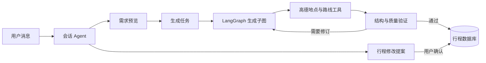

# TravelMind

TravelMind 是一个面向中国大陆旅行场景的 AI 行程规划后端。API 负责认证、行程管理和任务入队，独立 Worker 调用模型与地图工具并持久化结果。

## 项目预览

### 登录页


### 桌面端


### Agent 生成过程


### 移动端

<p align="center">
  
  
</p>

## Agent 架构

TravelMind 使用 LangChain 绑定 DeepSeek 工具，使用 LangGraph 显式编排会话和行程生成状态：



- 会话 Agent 会根据当前状态动态选择需求工具或行程修改工具。
- 修改先形成可审查提案，只有用户确认后才写入行程并重算路线。
- 生成子图由 `model → tools → validate` 三类节点组成。
- 每个 `GenerationRun` 使用 `generation-{run_id}` 作为 LangGraph thread ID。
- SQLite checkpointer 在每个图步骤同步落盘；Worker 中断后会重新入队并从最近检查点继续。
- SQLAlchemy 仍是用户、对话、提案和最终行程的业务事实来源。

## 本地启动

在项目根目录执行：

```powershell
python -m venv .venv
.\.venv\Scripts\python.exe -m pip install -r requirements.txt
Copy-Item .env.example .env
```

先生成一个只保存在本机的 JWT 密钥：

```powershell
python -c "import secrets; print(secrets.token_urlsafe(48))"
```

把输出填写到 `.env` 的 `JWT_SECRET_KEY`，再填写 DeepSeek 和高德配置。JWT 密钥少于 32 个字符、缺失或仍是示例值时，应用会拒绝启动。然后用迁移建立或升级数据库：

```powershell
.\.venv\Scripts\python.exe bootstrap_db.py
```

聊天和生成额度默认关闭。公开部署时可以在 `.env` 中设置非零值：

```dotenv
MAX_CHAT_MESSAGES_PER_MINUTE=0
MAX_CHAT_MESSAGES_PER_DAY=0
MAX_GENERATIONS_PER_MINUTE=0
MAX_GENERATIONS_PER_DAY=0
LANGGRAPH_CHECKPOINT_PATH=.runtime/langgraph-checkpoints.db
```

数值 `0` 表示不限制。`.runtime/` 只保存本地 LangGraph 检查点，不应提交到 Git。

可以使用一个命令同时启动 API、生成任务 Worker 和 Vue 前端：

```powershell
.\.venv\Scripts\python.exe dev.py
```

浏览器打开 `http://127.0.0.1:5173`。按 `Ctrl+C` 会同时停止三个服务。

也可以分别启动 API 和生成任务 Worker：

```powershell
.\.venv\Scripts\python.exe -m uvicorn app.main:app --reload
```

```powershell
.\.venv\Scripts\python.exe -m app.generation.worker
```

API 收到 `POST /trips/{trip_id}/generate` 后只返回持久化的 `queued` 任务。即使 API 重启，Worker 仍能继续读取它。可通过 `GET /trips/{trip_id}/generation-runs/latest` 轮询状态。

## 前端启动

前端位于 `frontend/`，使用 Vue 3、Vue Router 和 Vite。开发环境会把 `/api` 请求代理到 `http://127.0.0.1:8000`。如果不使用根目录的 `dev.py`，需要先手动启动 API 和 Worker：

```powershell
Set-Location frontend
Copy-Item .env.example .env
pnpm install
pnpm dev
```

浏览器打开终端显示的本地地址即可。行程详情页即使没有配置地图密钥，也会显示项目自带的路线兜底图；如需真实高德地图，请在 `frontend/.env` 中填写 Web 端 JS API 的 Key 和安全密钥：

## 安全说明

- 真实密钥只允许保存在 `.env` 和 `frontend/.env`，两个文件均被 Git 忽略。
- 不要提交 SQLite、`.runtime/`、`frontend/dist/` 或日志；构建后的浏览器 JavaScript 会包含前端高德 Key。
- 前端 Key 应在高德控制台设置可用域名，后端 Web 服务 Key 应按部署环境限制来源。
- 如果密钥曾出现在聊天、日志、截图或公开仓库中，应先在服务商控制台轮换，再更新本地 `.env`。

```dotenv
VITE_AMAP_JS_KEY=你的高德_JS_API_Key
VITE_AMAP_SECURITY_CODE=你的高德安全密钥
```

这里必须使用高德 Web 端 JS API Key，不能把后端的 Web 服务 Key 暴露给浏览器。

## 验证

```powershell
.\.venv\Scripts\python.exe -m unittest discover -s tests -v
.\.venv\Scripts\python.exe -m alembic check
Set-Location frontend
pnpm build
```

只让 Worker 尝试处理一条任务后退出：

```powershell
.\.venv\Scripts\python.exe -m app.generation.worker --once
```
